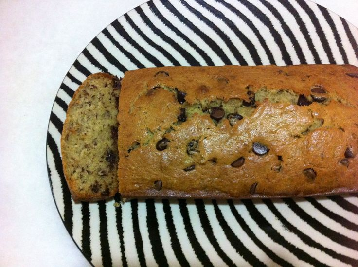

## Cakes

### Simplest, Yummiest Banana Bread

*easy, no mixer required*

*minimal technique required, very forgiving*

* 1/4 cup (57gr) butter at room temperature
* 1/2 cup granulated sugar (reduce if adding chocolate)
* 1 large egg
* 3/4 cup flour
* 1/2 tsp baking soda
* 1/2 tsp salt
* 1/2 cup mashed ripe bananas
* 1/4 cup sour cream
* 1/2 tsp vanilla extract
* 1/4 to 1/2 cup chocolate chips / chopped walnut

Preheat oven 180 degree Celcius.  Grease pan with butter.

Beat butter and sugar till light & fluffy.  Add egg and incorporate.

Mix all dry ingredients (flour, baking soda, salt) evenly.

Mix all dry and wet ingredients.  

Bake for 30 minutes.

**Tips:**

1. Try different varieties of bananas for different subtlety of flavors.  

2. Sugar should be adjusted according to the sweetness of the bananas.

3. Personally, I will avoid 'pretty' bananas like Del Monte, and go for the less pretty ones from Malaysia/Indonesia, such as *pisang berangan*.  

4. Don't hesitate to use **extremely ripe bananas**.  'Bananas going bad' give you the strongest *banana* flavor.
